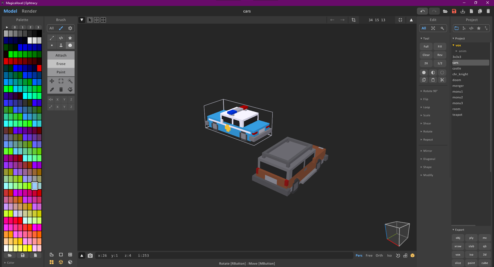

+++
categories = ['zig', 'parsing']
date = '2023-08-24'
title = "Parsing MagicaVoxel file format with Zig"
+++

[MagicaVoxel](https://ephtracy.github.io/) is a free and fully featured voxel art editing software available on the 3 big platforms. This software is quite popular among game devs and artists as it allows to edit and sculpt 3D objects as a volume of voxels (think of a colored pixel but 3D). The editor also enables exporting models in a variety of formats, ranging from .obj to use in 3D engines to volume formats, namely a simple to parse in-house format (.vox).

<div align="center">
    </img>
    <i>User interface of the editor with in the bottom right corner buttons for various export formats.</i>
</div>

I recently started playing with [Zig](https://ziglang.org/), a new programming language that aims to be simple, fast and safe to use and eventually replace C. I quickly found myself experimenting with zig for game dev purposes, namely writing a portable and fast voxel engine and hence needed a way to import voxel objects in my engine, so I started searching for a lib to import magicavoxel files. However the language is still very young and the ecosystem immature (the package manager just became a real thing very recently as of the 0.11 release), and as such I didn't found a lib to import .vox files, so I decided to write my own (hence this post).

I have a confession to make, I never had at making my own format parser before (yeah I’m lazy!) so I was worried it would take quite some time. However, I was pleasantly surprised by how easy it was to parse the format because of [the available documentation on the format](https://github.com/ephtracy/voxel-model/blob/master/MagicaVoxel-file-format-vox.txt) (from the author of MagicaVoxel themselves) and how I ended up using no external libraries but only the standard library of Zig for the task.

## The .vox format

A magicavoxel file starts by a format header (`"VOX "`) followed by an unsigned integer indicating the format version (which is 200 as of the time of writing this article).

The file then contains multiple sections of data (chunks) which all possess the same structure:
| Size                 | Description                                                                                                                       |
|----------------------|-----------------------------------------------------------------------------------------------------------------------------------|
| 4 bytes (char)       | The chunk ID                                                                                                                      |
| 4 bytes (u32)        | The size in bytes of the chunk content                                                                                            |
| 4 bytes (u32)        | The size in bytes of the children chunks (This is ever only valid for the `MAIN` chunk and denotes the size of the file contents) |
| *content_size* bytes | The content of the chunk                                                                                                          |


Zig provides a convenient way to parse this data with the [`std.io.Reader`](https://ziglang.org/documentation/master/std/#A;std:io.Reader) interface which allows to read data from a file in a streaming fashion. It provides a `readStruct` to read bytes and interpret them as a struct. This allows us to write the following to parse the chunks:

```zig
const std = @import("std");

pub fn main() !void {
    var allocator = std.heap.GeneralPurposeAllocator(.{}){};
    defer _ = allocator.deinit();

    var file = try std.fs.cwd().openFile("test.vox", .{});
    defer file.close();

    try read_format(file.reader());
}

const ChunkHeader = extern struct {
    id: [4]u8,
    content_size: u32,
    children_size: u32,
};

pub fn read_format(reader: anytype) !void {
    // Checking file header
    const header = try reader.readBytesNoEof(4);
    if (!std.mem.eql(u8, &header, "VOX ")) {
        return error.VoxFileInvalidHeader;
    }

    // Checking file version
    const format_ver = try reader.readIntLittle(u32);
    std.log.debug("Format version: {}", .{format_ver});

    while (true) {
        read_chunk(reader) catch |err| switch (err) { // this shouldn't simply return err on EOF as this will break on incomplete files
            error.EndOfStream => break,
            else => return err,
        };
    }
}

fn read_chunk(reader: anytype) !void {
    const chunk_header = try reader.readStruct(ChunkHeader);
    std.log.debug("Skipped unknown chunk {s} (Size: {}b) (Children: {}b)", .{ chunk_header.id, chunk_header.content_size, chunk_header.children_size });
    try reader.skipBytes(chunk_header.content_size, .{});
}


```

Let's run it and see what we get:

```sh
debug: Format version: 200
debug: Skipped unknown chunk MAIN (Size: 0b) (Children: 788004b)
debug: Skipped unknown chunk SIZE (Size: 12b) (Children: 0b)    
debug: Skipped unknown chunk XYZI (Size: 137428b) (Children: 0b)
debug: Skipped unknown chunk SIZE (Size: 12b) (Children: 0b)    
debug: Skipped unknown chunk XYZI (Size: 627772b) (Children: 0b)
debug: Skipped unknown chunk nTRN (Size: 28b) (Children: 0b)    
debug: Skipped unknown chunk nGRP (Size: 20b) (Children: 0b)    
debug: Skipped unknown chunk nTRN (Size: 46b) (Children: 0b)    
debug: Skipped unknown chunk nSHP (Size: 20b) (Children: 0b)    
debug: Skipped unknown chunk nTRN (Size: 45b) (Children: 0b)    
debug: Skipped unknown chunk nSHP (Size: 20b) (Children: 0b)    
debug: Skipped unknown chunk LAYR (Size: 51b) (Children: 0b)    
debug: Skipped unknown chunk LAYR (Size: 49b) (Children: 0b)    
(30x more LAYR chunks)
debug: Skipped unknown chunk RGBA (Size: 1024b) (Children: 0b)
debug: Skipped unknown chunk MATL (Size: 54b) (Children: 0b)
(255x more MATL chunks)
debug: Skipped unknown chunk rOBJ (Size: 92b) (Children: 0b)
(13x more rOBJ chunks)
debug: Skipped unknown chunk rOBJ (Size: 130b) (Children: 0b)
debug: Skipped unknown chunk rCAM (Size: 117b) (Children: 0b)
debug: Skipped unknown chunk rCAM (Size: 117b) (Children: 0b)
debug: Skipped unknown chunk rCAM (Size: 117b) (Children: 0b)
debug: Skipped unknown chunk rCAM (Size: 117b) (Children: 0b)
debug: Skipped unknown chunk rCAM (Size: 117b) (Children: 0b)
debug: Skipped unknown chunk rCAM (Size: 117b) (Children: 0b)
debug: Skipped unknown chunk rCAM (Size: 117b) (Children: 0b)
debug: Skipped unknown chunk rCAM (Size: 117b) (Children: 0b)
debug: Skipped unknown chunk rCAM (Size: 117b) (Children: 0b)
debug: Skipped unknown chunk rCAM (Size: 117b) (Children: 0b)
debug: Skipped unknown chunk NOTE (Size: 136b) (Children: 0b)
```

The 3 chunks that are of my interest are the `SIZE` chunks which contain the size of the model in voxels, the `XYZI` chunks which contain the actual voxel data and the `RGBA` chunk which contains the palette of colors used in the model. The other chunks are supplementary data that I will ignore for now. Their usage can be found [here](https://github.com/ephtracy/voxel-model/blob/master/MagicaVoxel-file-format-vox-extension.txt).

As you can see we can have multiple `SIZE` and `XYZI` chunks per file, which mean multiple models per file.

### Parsing the models

The two chunks we need to parse are the `SIZE` and `XYZI` chunks. Here's their structure:

**SIZE chunk**
| Size          | Description                                   |
|---------------|-----------------------------------------------|
| 4 bytes (u32) | The size of the model in voxels on the X axis |
| 4 bytes (u32) | The size of the model in voxels on the Y axis |
| 4 bytes (u32) | The size of the model in voxels on the Z axis |

**XYZI chunk**
| Size                | Description                           |
|---------------------|---------------------------------------|
| 4 bytes (u32)       | The number *N* of voxels in the chunk |
| 4 bytes (u32) x *N* | The X coordinate of the voxel         |

We can describe them in Zig code as :

```zig	
/// Size of a model in voxels
const ModelSize = extern struct {
    x: u32,
    y: u32,
    z: u32,
};

const Voxel = extern struct {
    x: u8,
    y: u8,
    z: u8,
    color_index: u8,
};

```

We update our `read_chunk` to read these chunks:

```zig

fn read_chunk(reader: anytype) !void {
    const chunk_header = try reader.readStruct(ChunkHeader);
    if (std.mem.eql(u8, &chunk_header.id, "MAIN")) { //skip this one
        return;
    } else if (std.mem.eql(u8, &chunk_header.id, "SIZE")) {
        var size = try reader.readStruct(ModelSize);
        std.log.debug("Model size: {}x{}x{}", .{ size.x, size.y, size.z });
    } else if (std.mem.eql(u8, &chunk_header.id, "XYZI")) {
        const num_voxels = try reader.readIntLittle(u32);
        std.log.debug("Number of non-empty voxels: {}", .{num_voxels});
        for (0..num_voxels) |_| {
            // parse the voxel and store it here ...
            const voxel = try reader.readStruct(Voxel);
            std.log.debug("Voxel at ({}, {}, {}) with color index {}", .{ voxel.x, voxel.y, voxel.z, voxel.color_index });
            // store the voxel somewhere
        }
    } else {
        std.log.debug("Skipped unknown chunk {s} (Size: {}b) (Children: {}b)", .{ chunk_header.id, chunk_header.content_size, chunk_header.children_size });
        try reader.skipBytes(chunk_header.content_size, .{});
    }
}

```

We run our program again and ...

```sh
debug: Format version: 200
debug: Model size: 40x40x40
debug: Number of non-empty voxels: 34356 
debug: Voxel at (0, 0, 0) with color index 1 
debug: Voxel at (1, 0, 0) with color index 1 
debug: Voxel at (2, 0, 0) with color index 1 
debug: Voxel at (3, 0, 0) with color index 1 
debug: Voxel at (4, 0, 0) with color index 1 
debug: Voxel at (5, 0, 0) with color index 1 
... A  lot of voxels later
debug: Model size: 126x126x118
debug: Number of non-empty voxels: 156942
debug: Voxel at (0, 0, 0) with color index 1 
debug: Voxel at (1, 0, 0) with color index 1 
debug: Voxel at (2, 0, 0) with color index 1 
debug: Voxel at (3, 0, 0) with color index 1 
debug: Voxel at (4, 0, 0) with color index 1 
debug: Voxel at (5, 0, 0) with color index 1 
debug: Voxel at (6, 0, 0) with color index 1 
debug: Voxel at (7, 0, 0) with color index 1 
debug: Voxel at (8, 0, 0) with color index 1 
debug: Voxel at (9, 0, 0) with color index 1 
debug: Voxel at (10, 0, 0) with color index 1
debug: Voxel at (11, 0, 0) with color index 1
debug: Voxel at (12, 0, 0) with color index 1
... A lot of voxels later
debug: Skipped unknown chunk nTRN (Size: 28b) (Children: 0b)
...
```

### Parsing the palette

What's left is parsing the `RGBA` chunk which is the palette of colors used in the model. It is structured as a 256 element long array of ARGB colors, or in zig code:

```zig

const Palette = extern struct {
    // the palette encoded in ARGB hex
    colors: [256]u32,
};

```

We update our `read_chunk` function to read this chunk:


```zig

fn read_chunk(reader: anytype) !void {
    const chunk_header = try reader.readStruct(ChunkHeader);
    if (std.mem.eql(u8, &chunk_header.id, "MAIN")) { //skip this one
        return;
    } else if (std.mem.eql(u8, &chunk_header.id, "SIZE")) {
        var size = try reader.readStruct(ModelSize);
        std.log.debug("Model size: {}x{}x{}", .{ size.x, size.y, size.z });
    } else if (std.mem.eql(u8, &chunk_header.id, "XYZI")) {
        const num_voxels = try reader.readIntLittle(u32);
        std.log.debug("Number of non-empty voxels: {}", .{num_voxels});
        for (0..num_voxels) |_| {
            // parse the voxel and store it here ...
            const voxel = try reader.readStruct(Voxel);
            std.log.debug("Voxel at ({}, {}, {}) with color index {}", .{ voxel.x, voxel.y, voxel.z, voxel.color_index });
            // store the voxel somewhere
        }
    } else if (std.mem.eql(u8, &chunk_header.id, "RGBA")) {
        const palette = try reader.readStruct(Palette);
        std.log.debug("Palette: {x}", .{palette.colors});
    } else {
        std.log.debug("Skipped unknown chunk {s} (Size: {}b) (Children: {}b)", .{ chunk_header.id, chunk_header.content_size, chunk_header.children_size });
        try reader.skipBytes(chunk_header.content_size, .{});
    }
}
```

And voilà! I can now parse enough of the .vox format to be able to import voxel models. And all that in … 81 lines of code! However, this isn’t a full-fledged .vox parser as it doesn’t parse the supplementary chunks nor does stores anywhere the parsed voxels but it is still a good start to be extended and tweaked according to the use cases.


## Conclusion

Writing this parser was done in an afternoon and was very fun to do. I was really surprised by how much code is actually required to parse it but that's thanks to the Zig standard library features. I urge anyone to try Zig even though it's still in early development days as it is a concise, simple and yet powerful language that get things done quickly and has a bright future ahead, I hope.


## Links & Source code

* [MagicaVoxel file format documentation](https://github.com/ephtracy/voxel-model/blob/master)

* [Zig std.io.Reader doc](https://ziglang.org/documentation/master/std/#A;std:io.Reader)

The full source code of the parser of this article can be found [here](./source.zig)